## IAM Lab Screenshots

### IAM Dashboard & Sign-In
- 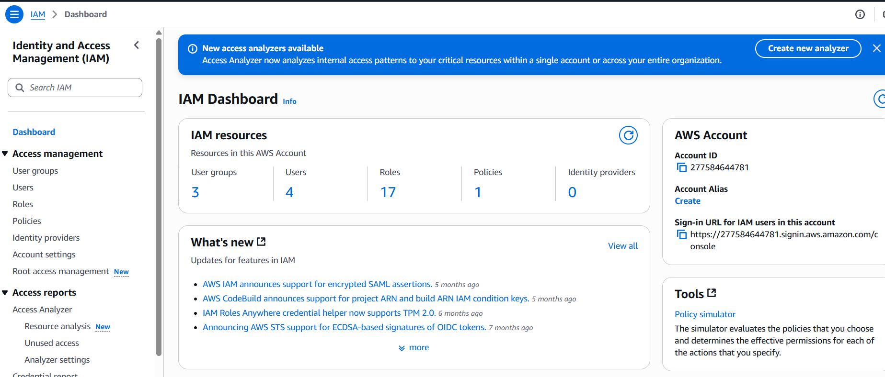
- 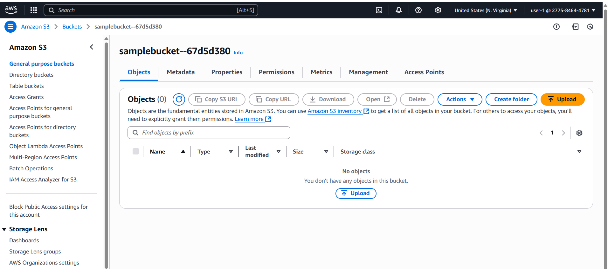

### user-1 (S3 Support)
- 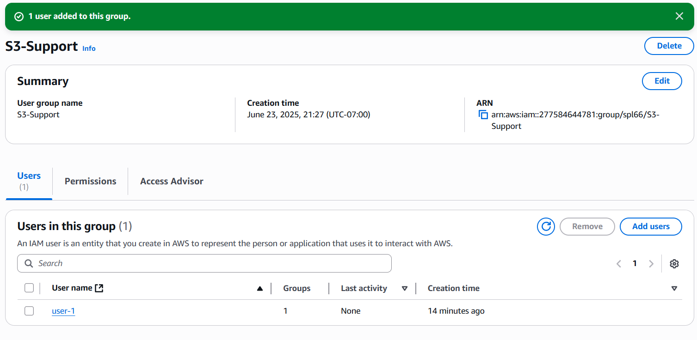
- 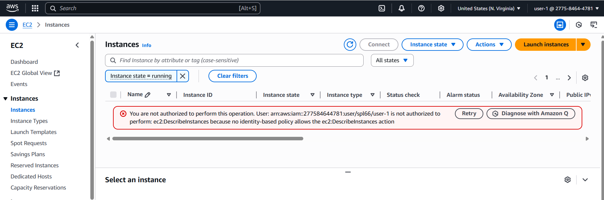

### user-2 (EC2 Support)
- 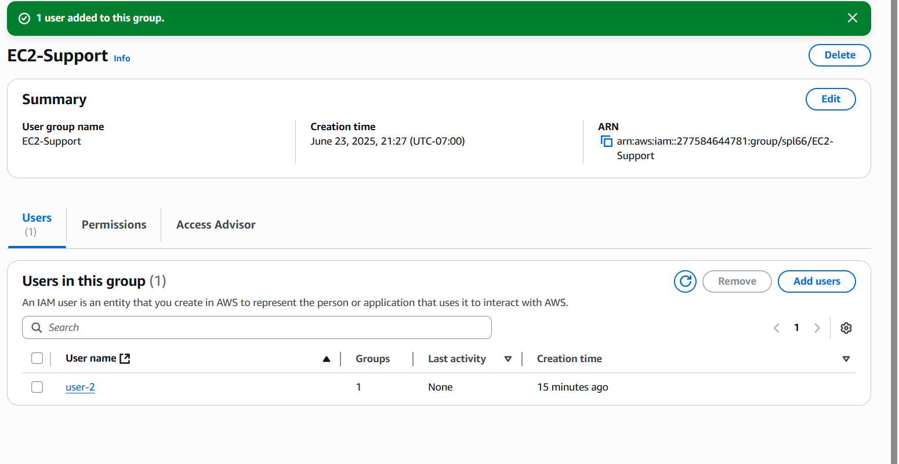
- 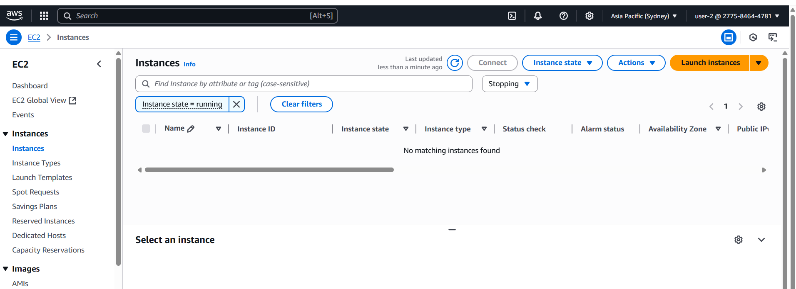

### user-3 (EC2 Admin)
- 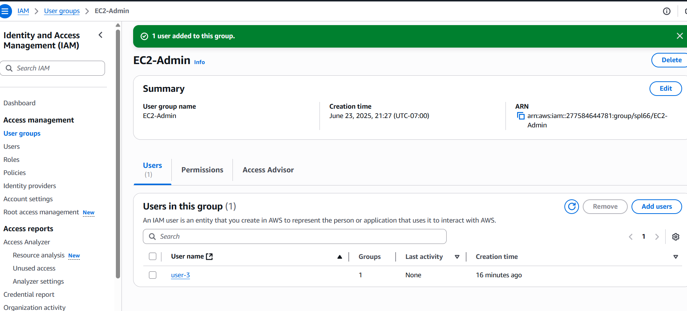
- 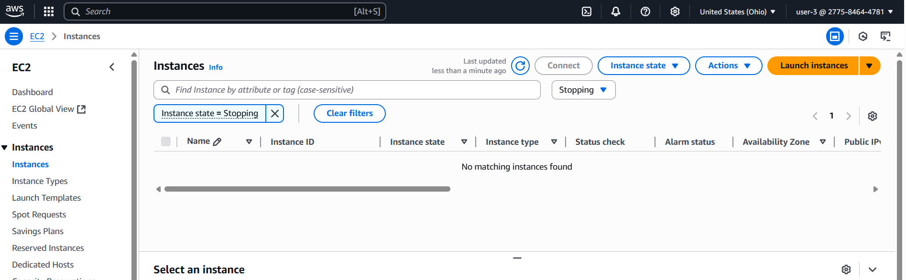

---

## VPC Lab Screenshots
- 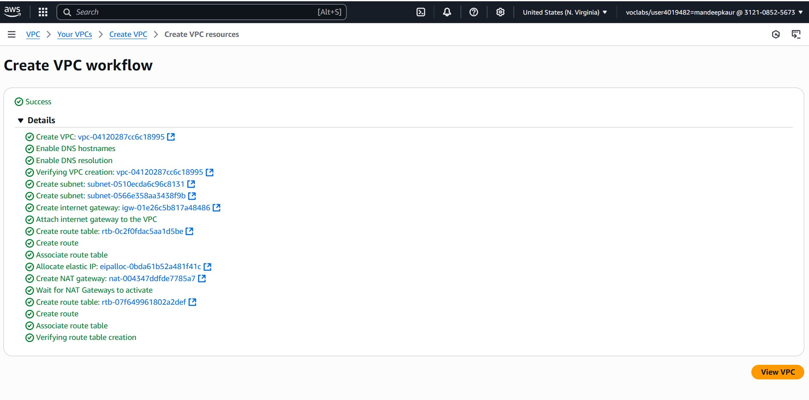
- 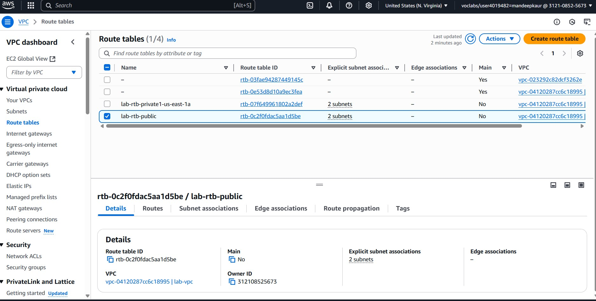
- 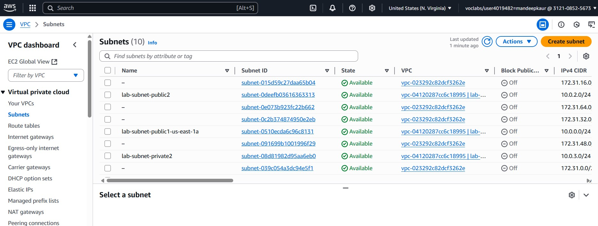
- 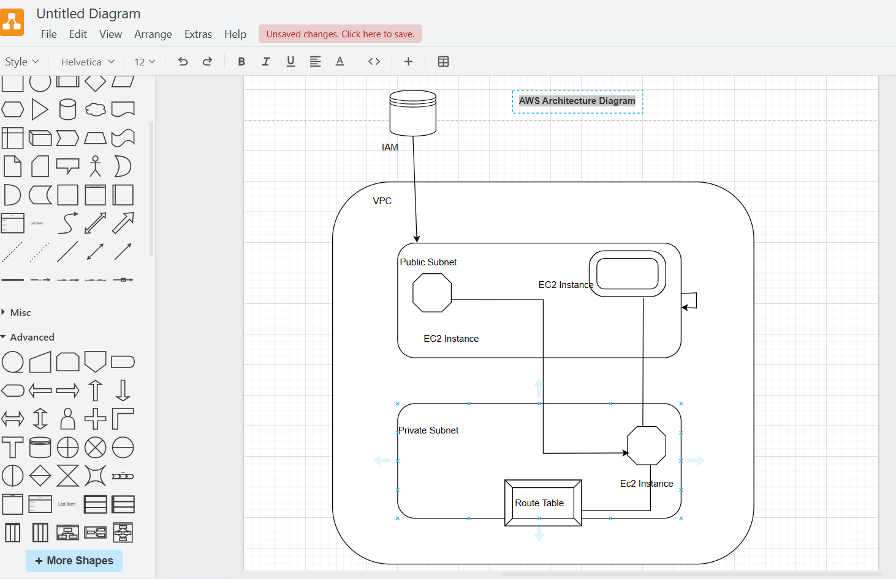

---

## Lab Results
- 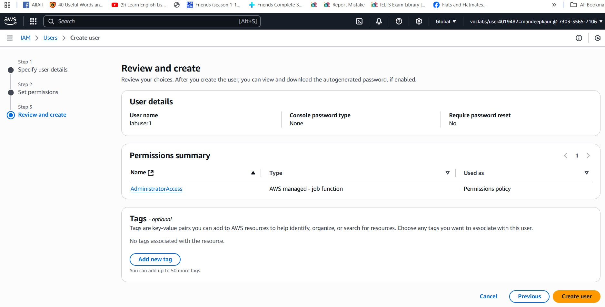
- 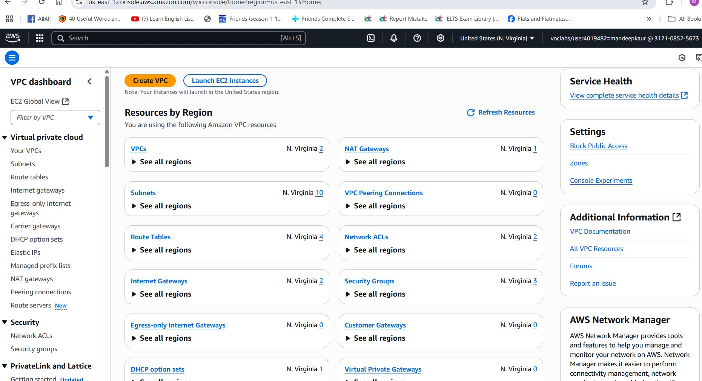

---

## diagram
- 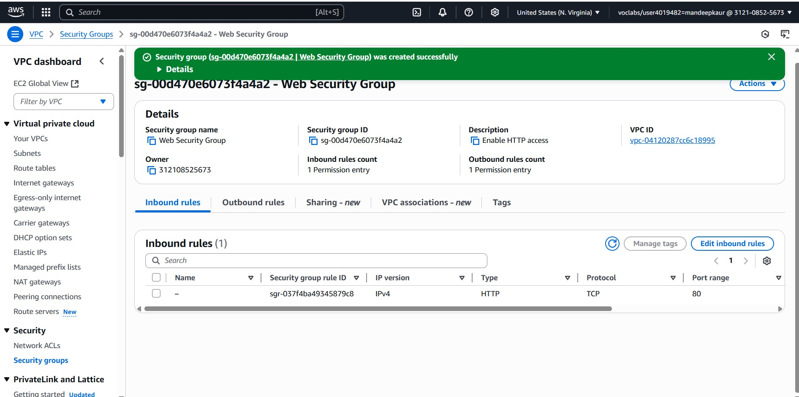
- 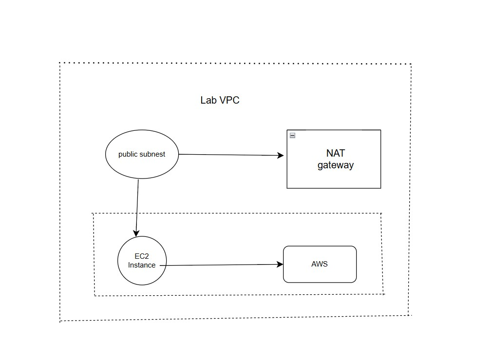
- 
##Lambda
- 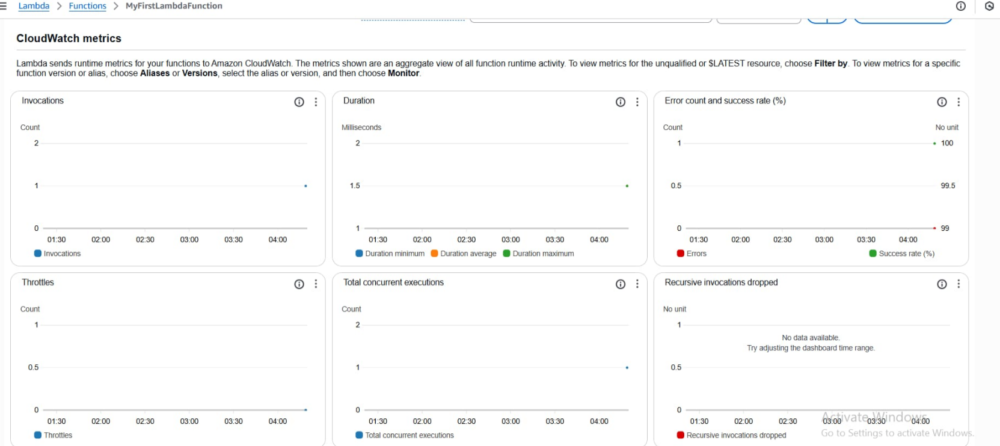

- ##Learning Outcomes
The skills that I got by doing this AWS portfolio are:
This lab illustrated how IAM roles and policies can be used to give a regulated access according to job roles. 
This was tested on each of the users (user-1, user-2, user-3) to determine the permission boundaries in S3 and EC2. 
The findings confirmed the fact that:
IAM policies behave the way one would hope each group should be assigned
Managed and inline policies can be utilized in giving access
The appropriate enforcement of the access control is achieved through the application of the role-based groups
Planning out VPCs with safety and adjustable networks
Creating and setting up EC2 instances with the usage of web servers
The creation and the attachments of EBS volumes
AWS Lambda as the serverless workflow building tool
Deploying cloud infrastructure diagrams Structuring cloud infrastructure diagrams

