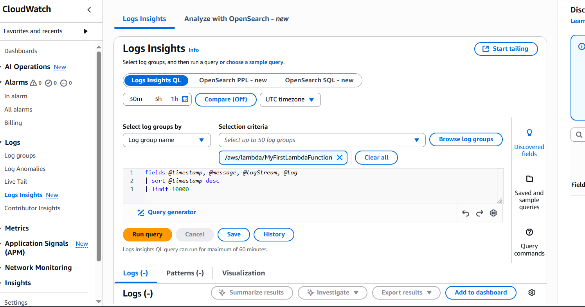

## IAM Lab Screenshots

### IAM Dashboard & Sign-In
- 
- 

### user-1 (S3 Support)
- 
- 

### user-2 (EC2 Support)
- 
- 

### user-3 (EC2 Admin)
- 
- 

---

## VPC Lab Screenshots
- 
- 
- 
- 

---

## Lab Results
- 
- 

---

## diagram
- 
- 
- 
## Lambda Function Lab

### Lambda Function Screenshot

### Lambda Monitoring in CloudWatch

## EBS Lab Result

- ##Learning Outcomes
Having passed this AWS Data Analytics Portfolio, I acquired the following cloud computing and infrastructure competencies:

IAM- Identity and Access Management:
Knowledge on how to add users and implement policies to controlled access based on a role. Verified the boundary of permission with multiple user roles activated (user-1, user-2, user-3) with a different level of permission to EC2 and S3 services. Experience with managed and inline policy gained.

VPC -Virtual Private Cloud:
Implemented a practice in conducting and implementing a secure network with VPCs. Added subnets, related route tables and made the instances in the production environments publicly accessible. Acquired knowledge on IP allocations and segmentation of the network on isolated environments.

Serverless Computing Lambda Functions:
Implemented serverless using AWS Lambda. Established an automated event of terminating EC2 instances. Enabled the CloudWatch to monitor instances logs, performance metrics. Got to know how to associate IAM roles to allow execution of functions.

EBS-Elastic block store:
Researched creation of the EBS volume and mounting to EC2. Learned the various types of volumes, encryption, ability to snapshot and persistent storage of workloads.

Visualization of Cloud Architectures
A comprehensive infrastructure design was made to reflect the integration of service in AWS with IAM, VPC, EC2, EBS, and Lambda. This assisted in strengthening the knowledge on the interaction of services in the real world deployment.

